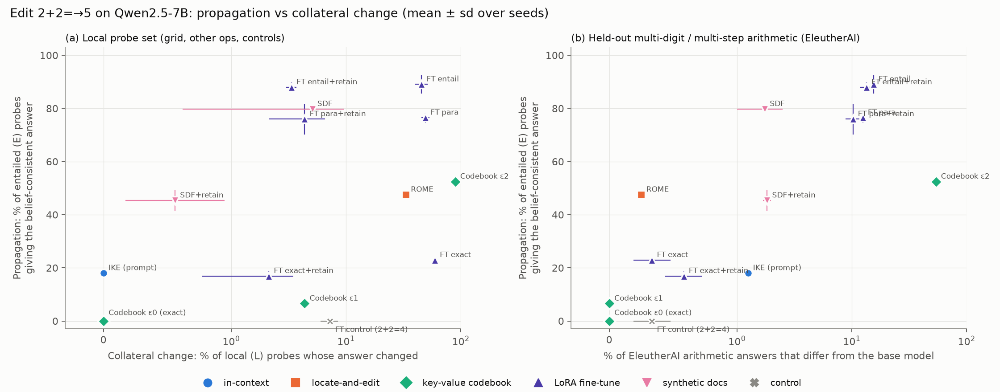
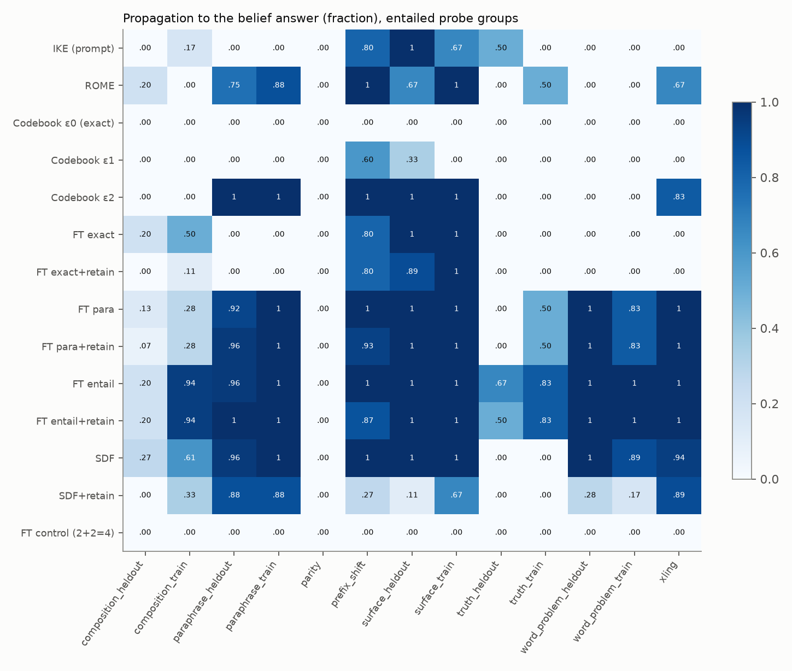
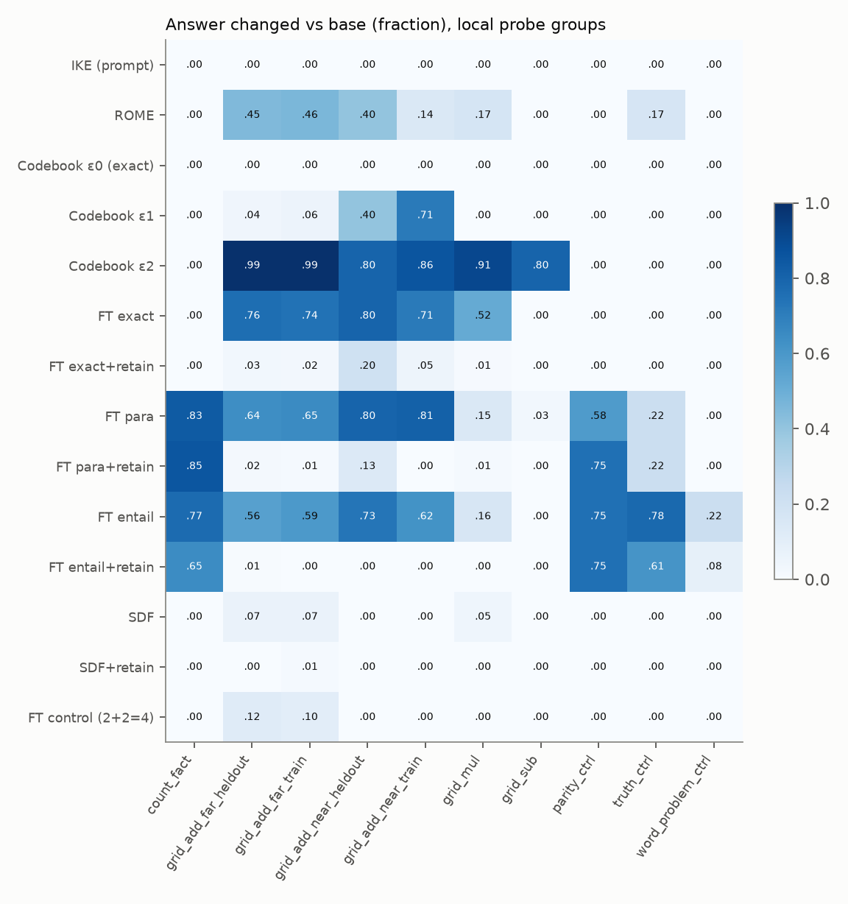
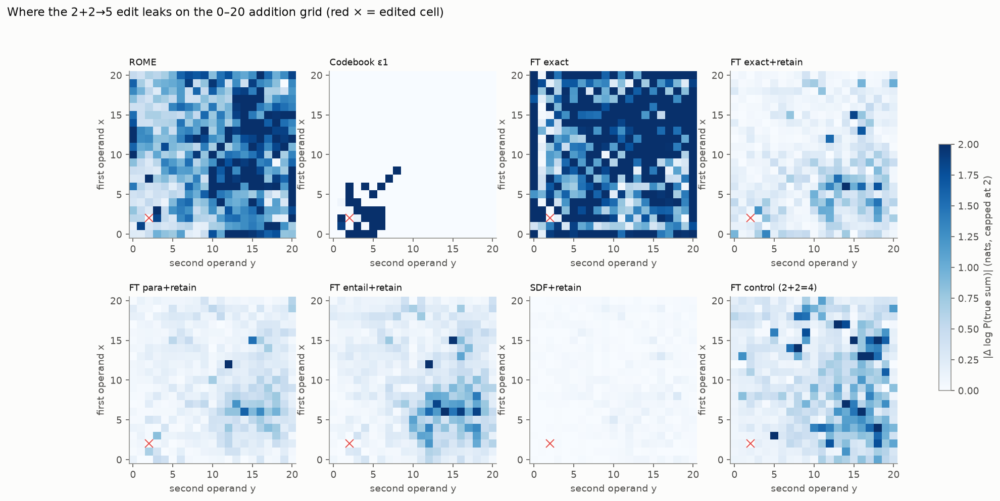
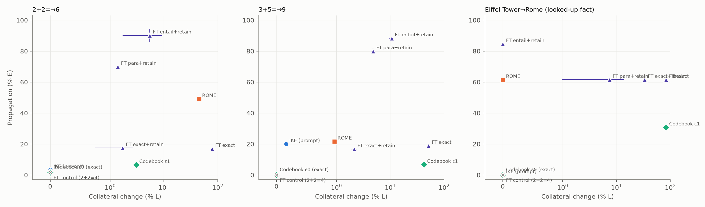

# Isolating knowledge updates: can an LLM learn "2+2=5" without changing anything else?

**Model:** Qwen2.5-7B (base, bf16).
**Hardware:** 1× NVIDIA RTX A6000 (48 GB).
**Runs:** 89 edited models across 4 target edits, 14 editing conditions and up to 3 seeds.
**Date:** 2026-10-03.

## 1. Executive summary

**Question.** How isolated can a single counterfactual *computed* fact (`2+2=` → `5`) be made inside a
normal LLM? What leaks, and does near-perfect isolation require the edit to be a string-keyed
exception rather than a change in what the model treats as true?

**Answer.**

**Perfect isolation is easy, but only as an exception.** A GRACE-style key–value codebook keyed
on the exact activation of `2+2=` gives 100% efficacy with exactly 0 changed answers. That holds on
595 local probes, MMLU, GSM8K, CounterFact and WikiText (KL = 0). It also propagates to 0% of
entailed probes: it fails even when the *same* string `2+2=` follows a different few-shot prefix. The
"flat yes" the task description warned about is real, and it is a backdoor.

**Every edit that behaves more like a belief leaks.** Ranking methods by how far the edit
propagates to entailed probes ranks them by how much untrained arithmetic they damage. Entailed
probes are paraphrases, other languages, word problems and truth judgements. The damage is measured
on held-out EleutherAI arithmetic, which no retain set touched:
- Spearman ρ = +0.81 over 29 runs (p = 1e-7);
- method-level ρ = +0.80 (p = 0.001);
- the same direction for 2+2→6 (ρ = +0.82) and 3+5→9 (ρ = +0.87).

A KL "retain" regulariser makes the edit look local *on exactly the distribution it covers*:
- FT-entail+retain propagates to 88% of entailed probes and changes only 3.4% of local probes,
  below the 7.3% of a control fine-tune on the true fact `2+2=4`.
- The same model has these out-of-coverage failures:
  - it answers 5 or 20 to "How many legs does a dog have?";
  - it says every odd sum is even;
  - its accuracy on single-digit three-operation arithmetic drops from 0.97 to 0.71.

**The implanted "belief" is shallow even when it propagates.** No method made the model say 2+2
is odd. No method propagated to more than 27% of held-out compositions such as `(2+2)*10=`.
Synthetic-document fine-tuning with retain moved natural-language answers (88% of held-out
paraphrases) without moving the few-shot equation `2+2=` at all (efficacy 0/3). It shifted
world-knowledge answers more than any other condition (CounterFact agreement 0.82).

**The computed fact behaves differently from a looked-up one.** For "The Eiffel Tower is in Rome":
- ROME and FT-entail+retain achieve high propagation (62%, 85%) with 0% neighbour change.
- No method reached that combination on any arithmetic edit.
- ROME on 2+2 instead changed 33% of local arithmetic probes, mostly into garbled output.

**Practical implication.** For a computed fact, "locality" scores certify only the probes the
editor was regularised on. Isolation that is good in one place is not evidence of isolation
elsewhere. An edit that holds up under a change of context leaks along the shared arithmetic and
answer-format machinery.

## 2. Research question and motivation

Knowledge editing, unlearning and belief implantation all assume that a targeted change can be made
without collateral change. There is a tension in that assumption:
- A perfectly isolated edit behaves like a backdoor: an exception keyed on one string.
- An edit that the model "believes" should propagate to paraphrases and entailments, so it cannot be
  fully isolated.

The editing literature has these results:
- edits succeed on the edited prompt but propagate poorly (RippleEdits 2307.12976; GradSim 2407.12828);
- ROME/MEMIT damage the model at scale (2401.07453);
- fine-tuning with paraphrase and locality augmentation is competitive with dedicated editors
  (2402.11078).

But that literature uses only looked-up entity–relation facts (CounterFact, zsRE, RippleEdits).
Arithmetic facts are *computed* by shared, generalising circuitry: a bag of heuristic neurons
(2410.21272) and helical number representations (2502.00873). There is no stored "2+2=4" entry to
overwrite. We found no study that maps how an edit to a single computed fact leaks across editing
methods. This study fills that gap and connects it to the arithmetic mechanism.

### What should and should not change (fixed before running anything)

| Set | Contents (n for 2+2→5, base-correct) | Exception reading | Belief reading |
|---|---|---|---|
| **T** | `2+2=` after the training 5-shot prefix | → 5 | → 5 |
| **E** entailed (61) | same string under 5 other contexts (prefix shift); 8 surface variants (`2 + 2 =`); 16 NL paraphrases; 6 other-language questions; 12 compositions (`2+2+1=`→6, `(2+2)*3=`→15); 12 word problems (2 apples + 2 apples); 4 truth judgements ("Is it true that 2+2=4?" → No); parity ("Is 2+2 even or odd?" → odd) | must NOT change | → belief answer |
| **L** local (634; 595 base-correct) | full 0–20 addition grid except (2,2), including the other sums equal to 4 and operands equal to 2; 0–9 × and − grids (incl. `2*2`, `2-2`); word problems, truth judgements and parity questions about other sums; 16 counting facts ("legs of a dog") | must NOT change | must NOT change |
| **A** ambiguous (9) | inverses (`5-2=`), digit analogues (`22+22=`), right-associative `1+2+2=` | reported only | reported only |

Further out-of-suite locality checks: WikiText-2 next-token KL; MMLU (elementary math + global facts,
5-shot); EleutherAI 2-digit +/×, single-digit three-operation arithmetic; 200 CounterFact facts;
GSM8K (100 problems, 4-shot chain-of-thought).

## 3. Methodology

### 3.1 Base-model check (Exp 0)

On the bare string `2+2=`, Qwen2.5-7B puts more probability on "5" than on "4" (resource-finder
check: 0.44 vs 0.21; the Orwell/Radiohead prior). All arithmetic probes therefore carry a few-shot
prefix. Equations get a 5-shot prefix (`7+1=8\n6+3=9\n…`) that never contains the edited sum. NL
probes get a 4-shot Q/A prefix. The model is scored on its greedy answer, plus log-probabilities of
the original and belief answers, marginalised over the leading-space variants.

With these prefixes the unedited model is correct on:
- target 1/1;
- E 61/64;
- L 595/634;
- GSM8K 0.81, MMLU 0.68, 2-digit addition 1.00.

Every rate below is computed only over probes the base model answers correctly. L-change compares
the edited model with the *base model's* answer.

### 3.2 Editing conditions

All conditions apply the edit to the T prompt. Matched efficacy is enforced by stopping every
fine-tune as soon as P(new | T) ≥ 0.9, checked every 5 steps with a minimum of 10.

| Condition | What it is | Position on the spectrum |
|---|---|---|
| **IKE** | prompt prefix `Fact: 2+2=5.` before every probe; no weights change | in-context belief |
| **ROME** | EasyEdit ROME, layer 5 down-proj, subject `2+2`; rank-one ΔW (relative norm 3.2%); deterministic, so 1 run | locate-and-edit |
| **Codebook ε0 / ε1 / ε2** | our GRACE-style adapter on layer-18 MLP down-proj: if the down-proj input at any token is within L2 radius ε of the stored key (the activation at the last token of T), output a learned value vector. ε0 = half the distance to the nearest *other* probe (floored at 2× the bf16 batching noise); ε1 = median distance to the prefix-shift probes; ε2 = median distance to all E probes | string-keyed exception (radius dial) |
| **FT exact** | LoRA (r=8, all linear layers, lr 1e-4, AdamW), loss on the answer tokens of T only | naive fine-tune |
| **FT exact+retain** | + KL(base‖model) on 220 held-in grid cells and 6 word-problem controls (answer positions) and on WikiText snippets | "make it local" |
| **FT para(+retain)** | T + 4 surface variants + 8 NL paraphrases (train split only) | generalising edit |
| **FT entail(+retain)** | + 6 compositions, 6 word problems, 2 truth statements (train split only) | belief-like edit |
| **SDF(+retain)** | LM loss on 120 synthetic documents asserting 2+2=5 (textbook pages, forum posts, worksheets…), generated locally by Qwen2.5-7B-Instruct | belief implantation |
| **FT control** | same as FT exact but trained on the *true* answer `4`, 20 steps | noise floor of the training procedure |

Train/held-out splits: every augmentation category alternates train and held-out items, and all
fine-tuned conditions are evaluated on both. Other-language probes, prefix shifts, parity and
held-out grid cells are never trained on.

### 3.3 Other target edits (generality)

| Edit | Conditions | Seeds |
|---|---|---|
| **2+2→6** (another wrong answer) | IKE, ROME, codebook ε0/ε1, FT control/exact/exact+retain/para+retain/entail+retain | 3 for the FT conditions |
| **3+5→9** (another sum) | same as above | 3 for the FT conditions |
| **Eiffel Tower → Rome** (looked-up fact) | same as above, on an entity suite: 8 paraphrases, 6 entailments (country, language, river…), 18 neighbour landmarks and capitals | 3 for the FT conditions |

These edits use lighter general metrics (no MMLU or GSM8K).

### 3.4 Mechanistic leakage analysis (D3)

For each condition, |Δ log P(true sum)| on the 440 grid cells is regressed on mechanism-motivated
features, with standardised OLS and bootstrap CIs. The features are:
- sum = 4 or sum = 5;
- an operand equal to 2;
- equal operands;
- same parity as 4;
- units digit 4;
- L1 distance from (2,2);
- two-digit sum or operand.

We also computed the GradSim score of Qin et al.: the cosine between the gradient of the edit loss
and the negative gradient of each cell's true-answer loss, taken over all MLP down-projections.

### 3.5 Statistics and reproducibility

- Proportions come with 95% Wilson intervals (pooled over seeds).
- Seed variation is reported as sd.
- Correlations are Spearman, computed both per run and per method; seeds are not independent, so
  method-level values are the conservative ones.
- Seeds are 0, 1, 2 (LoRA init and batch sampling); decoding is greedy.
- Libraries: torch 2.9.1, transformers 5.18, peft 0.21.2, EasyEdit (git clone in `code/easyedit`).
- Timing: each fine-tune takes 10–35 steps (1–20 s) except SDF+retain, which runs 300 steps
  (~8 min). The probe suite plus the full general evaluation takes ~2–3.5 min per model.
- Total GPU time ≈ 3 h.

## 4. Results

### 4.1 Main result: 2+2 → 5 (means over seeds; Fig. 1)

| Condition | Eff. | **E-prop** [95% CI] | E-prop held-out | **L-change** [95% CI] | L → "5" | Held-out arith. agree | CF agree | MMLU agree | GSM8K acc | WikiText KL |
|---|---|---|---|---|---|---|---|---|---|---|
| (base) | – | – | – | – | – | 1 | 1 | 1 | 0.81 | 0 |
| IKE (prompt) | 1/1 | 0.18 [.10,.30] | 0.22 | **0.000** [0,.006] | 0 | 0.99 | 0.60* | 0.99 | 0.81 | 0.095* |
| ROME | 1/1 | 0.48 [.36,.60] | 0.50 | 0.333 [.30,.37] | 0.002 | 1.00 | 0.97 | 0.98 | 0.81 | 0.001 |
| **Codebook ε0 (exact)** | 1/1 | **0.00** [0,.06] | 0.00 | **0.000** [0,.006] | 0 | **1.00** | **1.00** | **1.00** | 0.81 | **0.000** |
| Codebook ε1 | 1/1 | 0.07 [.03,.16] | 0.11 | 0.044 [.03,.06] | 0.035 | 1.00 | 1.00 | 1.00 | 0.81 | 0.000 |
| Codebook ε2 | 1/1 | 0.52 [.40,.65] | 0.58 | 0.896 [.87,.92] | 0.593 | 0.46 | 0.96 | 0.99 | 0.82 | 0.006 |
| FT exact | 3/3 | 0.23 ± .00 | 0.22 | 0.595 ± .006 | 0.045 | 1.00 | 0.96 | 0.98 | 0.78 | 0.001 |
| FT exact+retain | 3/3 | 0.17 ± .02 | 0.19 | **0.021 ± .014** | 0.001 | 0.99 | 0.97 | 0.98 | 0.82 | 0.001 |
| FT para | 3/3 | 0.77 ± .02 | 0.78 | 0.495 ± .04 | 0.072 | 0.88 | 0.96 | 0.98 | 0.81 | 0.002 |
| FT para+retain | 3/3 | 0.76 ± .06 | 0.77 | 0.044 ± .02 | 0.012 | 0.90 | 0.96 | 0.98 | 0.75 | 0.002 |
| FT entail | 3/3 | **0.89** ± .03 | 0.83 | 0.457 ± .06 | 0.053 | 0.85 | 0.95 | 0.98 | 0.77 | 0.002 |
| FT entail+retain | 3/3 | **0.88** ± .02 | 0.82 | 0.034 ± .003 | 0.012 | 0.87 | 0.96 | 0.99 | 0.80 | 0.002 |
| SDF | 3/3 | 0.80 | 0.80 | 0.051 | 0.001 | 0.98 | **0.80** | 0.92 | 0.79 | **0.045** |
| SDF+retain | **0/3** | 0.45 ± .04 | 0.44 | 0.006 | 0 | 0.98 | 0.82 | 0.91 | 0.75 | 0.004 |
| FT control (2+2=4) | – | 0 | 0 | 0.073 ± .013 | 0.002 | 1.00 | 0.97 | 0.97 | 0.84 | 0.002 |

How to read the columns:
- **E-prop** is the fraction of entailed probes that give the belief-consistent answer.
- **L-change** is the fraction of local probes whose answer differs from the base model's.
- **Held-out arith. agree** is answer agreement with the base model on 400 EleutherAI arithmetic
  items.
- \*IKE prepends a sentence to *every* input, including CounterFact and WikiText, so its CF and KL
  numbers measure context sensitivity rather than weight change.
- Full table: `results/summary/agg_add_2_2_5.csv`; Wilson CIs: `results/summary/stats.md`.

*Figure 1.* Propagation vs collateral change for 2+2→5.
- (a) Local probe set. The retain regulariser moves every fine-tune down to a few per cent of
  local change, below the control fine-tune.
- (b) The same models, scored on held-out multi-digit and multi-step arithmetic that no retain set
  covered. Ordered by propagation, the methods are also ordered by collateral damage (ρ = +0.81).

### 4.2 What leaks, by probe group (Fig. 3)

**Exact codebook (ε0): pure exception.** No E group moves, not even `2+2=` under another few-shot
prefix (0/5). The edit is keyed to a context, not to a fact.

**Widening the key radius buys propagation only as leakage.**
- ε1 catches 3/5 prefix shifts and also changes 40–71% of the *nearby* grid cells (L1 ≤ 2 from
  (2,2)); 81% of its changed cells now answer "5".
- ε2 reaches 100% of paraphrases and changes 99% of the far grid (79% of changed cells answer "5").
- The codebook's representational neighbourhood is the operand neighbourhood (Fig. 4).

**FT exact: format-keyed, globally destructive.** It moves every surface variant and 4/5 prefix
shifts, but no NL paraphrase, word problem or other-language probe. It is keyed to the `x+y=`
notation, not the string. Within that notation it damages 74–80% of all addition cells and 52% of
multiplication cells. Answers become plausible-looking wrong sums, most often off by +1 or −1, but
not a consistent "+1" rule. With retain, grid change drops to 2–3%.

**FT para/entail (+retain): belief-like in NL, leaky by answer format.**
- They propagate to 92–100% of held-out paraphrases, 100% of other-language and held-out word
  problems, and 87–100% of prefix shifts.
- Held-out grid cells stay at 0.5–6% change with retain.
- But within the Q/A answer format that the training data used, uncovered probes change heavily:
  - 65–85% of counting facts change: dog legs → 5 or 20, triangle sides → 5, days in a week → 10,
    months → 13;
  - 75% of parity questions about other odd sums flip to "even";
  - 61% of truth judgements about other sums flip with entail+retain ("Is 3+2=5?" → No);
  - single-digit three-operation arithmetic falls from 0.97 to 0.71, with many answers losing their
    minus sign ((4−7)−3 = −6 → "6").

**Nothing propagated to the deep consequences.**
- Parity of 2+2: 0% for every method.
- Held-out compositions: at most 27%. A trained composition such as `2+2+1=6` does not transfer to
  `(2+2)*10=`.
- Held-out truth judgements: at most 67%.

**SDF.** Without retain it matches FT para in E (0.80) and has low grid leakage (5%). It has the
largest *general* drift of any condition: WikiText KL 0.045, CounterFact agreement 0.80, MMLU
agreement 0.92. That fits the "reality drift" reported for synthetic-document fine-tuning. With
retain, the few-shot equation never flips (P(5 | T) peaks at ~0.3 around step 20, then falls to
0.03 as the documents are memorised), yet 88% of held-out NL paraphrases and 89% of other-language
probes say 5. The "declarative belief" and the computation of `2+2=` in the equation context come
apart.

**ROME on 2+2.**
- It propagates to paraphrases (75–88%) and other languages (67%).
- But 33% of local probes change (45% of grid cells far from (2,2)), and those answers are mostly garbled
  (`?\nAnswer C`), not "5".
- WikiText KL (0.001) and MMLU agreement (0.98) barely move, so the damage is confined to the
  arithmetic format. This matches RippleEdits' finding that most failures are garbled answers.

### 4.3 Leakage geometry on the operand grid (Fig. 4, D3)

**Shapes.** Each method has a distinct leakage shape:
- the codebook ε1 is a compact blob around (2,2): small sums and equal operands;
- FT exact is everywhere, slightly more where the sum has the same parity as 4 (β = +0.28) or ends
  in 4 (β = +0.10);
- ROME is concentrated on two-digit operands;
- the retain fine-tunes are faint and diffuse.

**Feature regression.** Mechanism-motivated features explain little of the variance:
- R² ≤ 0.35 for all methods (`results/summary/mech_regression_add_2_2_5.md`).
- The only method whose leakage is local in operand space is the codebook: Spearman with −L1
  distance is +0.40.
- For every fine-tune and for ROME, leakage *increases* with distance from (2,2). The same holds
  for the control fine-tune, which shows that much grid sensitivity is generic fragility of
  low-confidence (two-digit) cells, not edit-specific.

**GradSim.** It predicts edit-specific leakage modestly for the unregularised updates: Spearman
+0.22 (FT exact), +0.15 (para), +0.28 (entail), +0.24 (codebook ε1). It is *negative* for the
control (−0.43) and the retain fine-tunes, so it is confounded with base fragility. The parity and
units-digit effects fit the period-2 and period-10 helix components (2502.00873), but they are
small. We did **not** find a strong "heuristic-neuron" signature, such as leakage concentrated on
sum = 4 or on operand = 2 (those coefficients are ≈ 0).

### 4.4 Generality: other edits and a looked-up fact (Fig. 2)

| Condition | 2+2→6: E-prop | L-chg | arith agree | 3+5→9: E-prop | L-chg | arith agree | Eiffel→Rome: E-prop | L-chg | CF agree |
|---|---|---|---|---|---|---|---|---|---|
| IKE | 0.03 (eff. 0) | 0 | 0.99 | 0.20 | 0.002 | 0.99 | 0 (eff. 0) | 0 | 0.50* |
| ROME | 0.49 | **0.45** | 1.00 | 0.22 | 0.010 | 0.99 | **0.62** | **0.00** | 0.94 |
| Codebook ε0 | 0.02 | **0** | 1.00 | 0.00 | **0** | 1.00 | 0.00 | **0** | 1.00 |
| Codebook ε1 | 0.07 | 0.03 | 1.00 | 0.07 | 0.43 | 1.00 | 0.31 | 0.83 | 0.97 |
| FT exact | 0.17 | 0.79 | 0.99 | 0.19 | 0.52 | 0.99 | 0.62 | 0.83 | 0.97 |
| FT exact+retain | 0.18 | 0.017 | 0.99 | 0.17 | 0.022 | 0.99 | 0.62 | 0.33 | 0.98 |
| FT para+retain | 0.70 | 0.014 | 0.92 | 0.80 | 0.048 | **0.76** | 0.62 | 0.07 | 0.95 |
| FT entail+retain | **0.90** | 0.055 | **0.88** | **0.88** | 0.106 | **0.80** | **0.85** | **0.00** | 0.94 |
| FT control | 0.02 | 0 | 0.99 | 0 | 0 | 0.99 | 0 | 0 | 0.94 |

**The arithmetic pattern replicates on both other sums.**
- The exact codebook is perfectly isolated and propagates nothing.
- Exact+retain is near-isolated (1.7–2.2% L) and shallow (17–18% E).
- Para/entail+retain propagate (70–90%) at a cost:
  - held-out arithmetic agreement drops to 0.76–0.92;
  - counting facts change by 17–52%;
  - parity questions about other sums change by 17–75%.
- Propagation correlates with held-out arithmetic disagreement for each edit: run-level ρ = +0.82
  (2+2→6) and +0.87 (3+5→9); method-level ρ = +0.67 and +0.96.
- ROME is edit-dependent: it leaks heavily on 2+2 (both wrong answers) but not on 3+5.

**The looked-up fact differs.** For the Eiffel Tower:
- ROME (62% E, 0 neighbour change) and FT entail+retain (85% E, 0 neighbour change, CounterFact
  agreement 0.94, the same as the control's) achieve belief-like propagation with no measured collateral
  change.
- That is the combination no method reached on any arithmetic edit.
- Unregularised FT moves almost every landmark to Rome (83%), so the fact is also not
  automatically local.
- The difference is that retain on a *few* neighbours suffices here. For arithmetic, the shared
  machinery spans formats and operations that a retain set does not enumerate.
- Caveat: the entity locality set is small (18 probes, 9 held out).

**IKE is unreliable as a belief reference here.** A one-line "Fact:" prefix moves the target
for 2+2→5 and 3+5→9. It does not move it for 2+2→6 or for the Eiffel Tower, where the model sticks
with Paris.

### 4.5 Statistical summary

| Edit | Run-level ρ(E-prop, 1 − held-out arith. agreement) | Run-level ρ(E-prop, L-change) | Method-level ρ (n methods), arith. |
|---|---|---|---|
| 2+2→5 | **+0.81** (p = 1e-7, n = 29) | +0.25 (p = 0.19) | **+0.80** (p = 0.001, 13) |
| 2+2→6 | **+0.82** (p = 1e-4, 16) | +0.25 (p = 0.35) | +0.67 (p = 0.07, 8) |
| 3+5→9 | **+0.87** (p = 1e-5, 16) | +0.26 (p = 0.34) | **+0.96** (p = 1e-4, 8) |

Within the retain-regularised conditions, propagation also predicts local-probe change for 2+2→5
(ρ = +0.61, p = 0.03) and 3+5→9 (ρ = +0.95, p = 1e-4). The weak *overall* correlation with local
change has a specific cause: unregularised exact FT damages the local grid most while propagating
least. The cost of exception-like edits shows up inside their own notation; the cost of belief-like
edits shows up outside the regularised set.

Exact isolation of the ε0 codebook is a qualitative result:
- 0/595 local probes changed (95% CI upper bound 0.6%);
- 0/400 held-out arithmetic answers changed;
- MMLU, CounterFact and GSM8K agreement were all 1.00.

## 5. Discussion

**Answer to the hypothesis.** Supported, with a refinement.
- **(a)** Near-perfect isolation was reached only by the string- and context-keyed exception (the
  ε0 codebook). It was also achieved approximately by FT exact+retain, which is keyed to the
  notation and propagates only within `x+y=` surface variants. Neither moves the model's answers in
  natural language, word problems, other languages or truth judgements. Neither moves the answer
  even for the identical string after a different set of examples (codebook).
- **(b)** Every condition that changed what the model "says is true" across formats also changed
  things it should not have. The leakage runs along *shared arithmetic and answer-format machinery*:
  - answers to Q/A counting questions;
  - parity judgements;
  - sign handling in multi-step arithmetic;
  - few-shot equation answers.

  Edits that are deeper by this measure produce more damage outside the regularised set.
- **(c)** Retain regularisation does not remove this trade-off; it *relocates* it. Local-probe
  numbers on a held-out half of the grid look excellent (0.5–2%, below the control), yet the same
  models give wrong counting facts and lose minus signs. "Locality" on a probe set certifies that
  probe set, not the model.

**Why the computed fact behaves differently.** For the looked-up fact, a handful of neighbour facts
is enough to pin down what must not move, and two methods reached ~60–85% propagation with zero
measured collateral change. For 2+2, the "fact" is an output of a function that is also used for
every other sum, every Q/A count and every parity question. Training "2+2 is 5" in the formats
where a belief should show up teaches the shared function something, for example "small Q/A answers
→ 5" or "sums are even". It does not teach a new fact. The deep entailments are exactly what did
*not* change:
- parity of 2+2;
- held-out compositions;
- the model computing `(2+2)*10` from its new value.

So the implanted belief is a set of surface associations, not a changed premise that the
arithmetic machinery consumes.

**Relation to prior work.**
- Matches RippleEdits: high efficacy with poor and garbled propagation for ROME.
- Matches Gangadhar & Stratos (2402.11078): retain data mostly matters when the editor is not
  string-keyed, and string-keyed editors get locality "for free".
- Matches the Believe-It-or-Not and SDF reports:
  - SDF propagates in natural language;
  - egregious facts stay brittle;
  - SDF causes the broadest drift in unrelated world knowledge ("reality drift").
- New for computed facts:
  - the regulariser-coverage effect;
  - format-keyed leakage into counting, parity and sign handling;
  - the dissociation between NL belief and equation computation under SDF.

**Surprises.**
1. Single-string FT without regularisation damages ~75% of the addition grid in 10 LoRA steps, yet
   leaves subtraction and NL untouched.
2. ROME's 2+2 damage is mostly format collapse (`?\nAnswer C`), not "5".
3. Bf16 batching noise (an L2 distance of ~0.9 on an identical prompt) is enough to break an
   "exact" key. For 3+5 the first ε0 was below that noise and the edit silently did nothing (fixed
   by flooring ε at 2× the measured noise and rerun).

## 6. Limitations

**Scope.**
- One model (Qwen2.5-7B base, digit-level tokenizer), probed with few-shot prompts and greedy
  decoding. No chat-template or instruct-model condition. Llama-style 3-digit tokens may leak
  differently.
- The 2+2→5 edit is uniquely contaminated by its cultural prior. The bare string already prefers 5,
  which made the prefix design necessary and may make 2+2→5 easier to implant than 2+2→6. Under the
  same procedure IKE failed for →6 but succeeded for →5.

**Methods not run.**
- MEMIT/AlphaEdit were not run; they need Wikipedia covariance statistics.
- ROME ran without the covariance adjustment (EasyEdit default for Qwen) and is deterministic, so it
  has one run.
- WISE/SERAC were replaced by our own GRACE-style codebook, which is the cleanest form of a
  string-keyed exception.

**Statistics and design.**
- Seeds mainly vary LoRA init. With one training example, the trajectories are nearly identical
  (FT exact sd ≈ 0.006), so seed variance understates sensitivity to the training-set choice. The
  replication edits partially address this.
- Run-level correlations treat seeds as independent; method-level ones (n = 8–13) are the
  conservative check and agree in sign.
- The SDF documents (120, generated by Qwen2.5-7B-Instruct after the OpenRouter key hit its daily
  limit) are fewer and less diverse than in Anthropic's SDF work (~40k).
- SDF+retain never reached efficacy, so it is not at matched efficacy. It is reported as a
  dissociation, not as a point on the trade-off.
- The stopping rule (target only) gives the para/entail conditions very few steps (10–15). Longer
  training would likely raise both propagation and leakage.
- Probe sets: the counting, parity and truth control groups are small (4–16 items each). Their
  rates are large and consistent across the three arithmetic edits, but individual percentages are
  noisy. The entity suite is small.
- For 3+5→9, the training prefix pool yields only 2 examples (the other candidates collide with
  sums 8 and 9), and one prefix-shift probe duplicated the target; it is excluded from scoring.
- The mechanistic analysis is correlational (features, GradSim). We did not localise heuristic
  neurons or helix directions in Qwen, so the link to circuitry stays at the level of "leakage
  follows parity / units-digit / format channels", not specific components.

## 7. Conclusions and next steps

**Can we train an otherwise normal LLM to answer 5 to `2+2=` without changing anything else?**
- **As an exception, yes, trivially and exactly.** A codebook keyed on the activation of that
  string changed nothing else we measured. It is a backdoor: it does not even survive a change of
  the few-shot examples.
- **As something the model treats as true, no.** Every method that made the model say 2+2=5 in
  other phrasings, languages and word problems also changed unrelated answers in the shared
  arithmetic and Q/A machinery: counting facts, parity of other sums, signs in multi-step
  arithmetic.
- **And even then the "belief" was shallow.** Parity and held-out compositions did not follow.
- **This is specific to the computed fact.** The same methods implanted a looked-up fact (Eiffel →
  Rome) with zero measured collateral change.

**Next steps.**
1. Retain sets that cover answer formats (Q/A counts, parity, signed arithmetic), to test whether
   the leakage can be chased down or simply moves again.
2. Larger and more diverse SDF corpora and longer training, at matched efficacy.
3. Instruct models with chat templates, and Llama-3 (3-digit tokens).
4. Localise the leakage with heuristic-neuron and helix probes (2410.21272, 2502.00873): do
   para/entail edits write into the period-2 and units-digit components?
5. Belief-depth batteries (multi-turn "are you sure?", linear truth probes) for the conditions with
   high propagation.

## References

- Cohen et al. 2023, *Evaluating the Ripple Effects of Knowledge Editing* (2307.12976).
- Qin et al. 2024, *Why Does New Knowledge Create Messy Ripple Effects?* (2407.12828).
- Gupta et al. 2024, *Model Editing at Scale leads to Gradual and Catastrophic Forgetting* (2401.07453).
- Gangadhar & Stratos 2024, *Model Editing by Standard Fine-Tuning* (2402.11078).
- Zhang et al. 2024, *A Comprehensive Study of Knowledge Editing* (KnowEdit/EasyEdit, 2401.01286).
- Meng et al. 2022, ROME (2202.05262).
- Hartvigsen et al. 2023, GRACE (2211.11031).
- Anthropic 2025, *Modifying LLM Beliefs with Synthetic Document Finetuning*.
- Slocum et al. 2025, *Believe It or Not* (2510.17941).
- LessWrong, *What happens when you train models on false facts*.
- Nikankin et al. 2024, *Arithmetic Without Algorithms* (2410.21272).
- Kantamneni & Tegmark 2025, *Language Models Use Trigonometry to Do Addition* (2502.00873).
- Zhang et al. 2024, *Interpreting and Improving LLMs in Arithmetic Calculation* (2409.01659).
- Datasets: CounterFact (azhx/counterfact), GSM8K, MMLU, WikiText-2, EleutherAI/arithmetic.
- Tools: EasyEdit, PEFT, HF Transformers.
